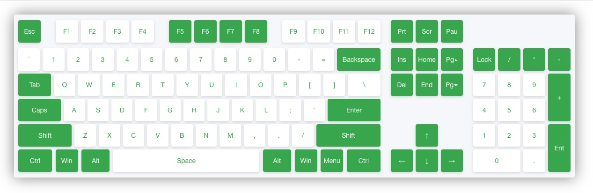

## JS键盘热键
> 支持各种按钮组合。原生js开发, 无任何依赖(不到`2KB`)。使用也非常简单。
>> 1.x版 功能键(Shift, Ctrl, Alt/Option, Win/Cmd)不区分左右。





### 使用
> 键盘

```js
import Keyboard from 'http://unpkg.bytedo.org/@bytedo/keyboard/dist/index.js'

var kb = new Keyboard()
// 默认整个document监听, 也可以单独对局部起效
// var kb = new Keyboard(document.querySelector('.foo'))

// 同时按Ctrl键和C键, 触发回调
kb.on(['ctrl + c'], ev => {
  // todo...
})

// 分别按下 Ctrl + C键, 然后再 300毫秒内按下Ctrl + V键, 触发回调
kb.on(['ctrl + c', 'ctrl + v'], ev => {
  // todo...
})

```


### 辅助功能键
> 辅助功能键, 不支持单独设置热键。
>> 包括 `Ctrl、Shift、Alt/Option、Win/Cmd` 这4个。


### 普通按键
> 即除了辅助功能键以外的其他按键。可以单独设置, 也可以配合辅助按键组合使用。
>> 但是, 不允许在一组里出现多次。如需要, 请分组。

```js

var kb = new Keyboard()

// 同时出现C和V这2个普通按键, 是不允许的,
kb.on(['ctrl + c + v'], ev => {
  // todo...
})

// 须改成分2组写
kb.on(['ctrl + c', 'ctrl + v'], ev => {
  // todo...
})

```


### API

+ .disabled
> 禁止属性, 允许临时暂时热键.


+ .on(actions`<Array>`, callback`<Function>`)
> 监听键盘动作组合, 支持单组或双组。
>> 双组时, 2组按键前后时差不能超过`300毫秒`, 否则视为2次独立的操作。
>> **键名不区分大小写**

---

+ .off(actions`<Array>`, callback`<Function>`)
> 移除键盘监听。

---

+ .destroy()
> 销毁整个键盘监听。


### 键名对照表
> 键名不区别大小写, 内部统一转为小写。


|  原始按键  |  修正后的键名  |  说明  |
|   :-:     |   :-:   |   -   |
| 0-9       |  0-9        | 数字键直接用阿拉伯数字, 不区别主键位和小数字键盘位 |
| A-Z       |  a-z        | 字母键同样不变, 直接原样使用 |
| F1-F12    |  f1-f12     | fn功能键,同样对应 |
| Prt       |  f13/print  | 2种写法都可以 |
| Scr       |  f14/screen | 2种写法都可以 |
| Pau       |  f15/pause  | 2种写法都可以 |
| left      |  left       | 方向键 |
| right     |  right      | 方向键 |
| up        |  up         | 方向键 |
| down      |  down       | 方向键 |
| Pg▴       |  pageup     | 向上翻页 |
| Pg▾       |  pagedown   | 向下翻页 |
| Home      |  home       | Home键 |
| End       |  end        | End键 |
| Ins       |  insert     | 插入键 |
| Del       |  delete     | 删除键(注意不是回退键) |
| Esc       |  esc        | 退出键(左上角) |
| Menu      |  menu       | 菜单键(部分键盘没有这个按键) |
| Caps      |  capslock   | 大写锁定键(这个键的使用要特别注意) |
| Numlock   |  numlock    | 数字键锁定键(87键以下的键盘没有) |
| Backspace |  backspace  | 回退键(=号键右边那个) |
| Tab       |  tab        | 制表符键 |
| Cmd/Win   |  meta       | Command/Win键(1.x版不区别左右) |
| Space     |  space      | 空格键 |
| Ctrl      |  ctrl       | Ctrl键(1.x版不区分左右) |
| Shift     |  shift      | Shift键(1.x版不区分左右) |
| Alt/Option|  alt        | Alt/Option键(1.x版不区分左右) |
| Enter     |  enter      | 回车键(1.x版不区分小数字键盘的回车) |
| '         |  '          | 单引号键 |
| *         |  *          | 小数字键盘中的乘号 |
| +         |  +          | 小数字键盘中的加号 |
| -         |  -          | 小数字键盘中的减号;及主键盘中的减号 (1.x版不区分) |
| /         |  /          | 小数字键盘中的除号;及主键盘中的斜杠 (1.x版不区分) |
| 。        |  .          | 小数字键盘中的小数点;及主键盘中的句号 (1.x版不区分) |
| ,         |  ,          | 逗号 |
| ;         |  ;          | 分号 |
| =         |  =          | 等号 |
| [         |  [          | 左边中括号 |
| ]         |  ]          | 右边中括号 |
| `         |  `          | 反引号(Tab上面的键) |
| \         |  \          | 反斜杠 |